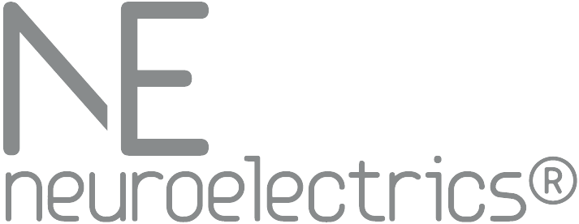

<div align="center">



# ne-mcp-eeg

**Open-source MCP server for EEG analysis with Neuroelectrics data formats.**

Connect [Neuroelectrics](https://www.neuroelectrics.com) EEG recordings to AI agents through the [Model Context Protocol](https://modelcontextprotocol.io) — analyze signal quality, compute spectral features, generate PDF reports, and explore EEG data through natural language.

[](https://www.python.org/downloads/)
[](LICENSE)
[](https://modelcontextprotocol.io)

</div>

---

## Table of Contents

- [Quick Start](#quick-start)
- [Connect to AI Assistants](#connect-to-ai-assistants)
- [Example Conversations](#example-conversations)
- [Tool Reference](#tool-reference)
- [Architecture](#architecture)
- [Reference Scripts](#reference-scripts)
- [Development](#development)
- [About Neuroelectrics](#about-neuroelectrics)
- [License](#license)

---

## Quick Start

```bash
pip install ne-mcp-eeg
```

Or, to install from source:

```bash
git clone https://github.com/giulioruffini/ne-mcp-eeg.git
cd ne-mcp-eeg
python3 -m venv .venv
source .venv/bin/activate   # On Windows: .venv\Scripts\activate
pip install -e .
```

Run the server:

```bash
ne-eeg-server
# or: python -m ne_eeg_server.server
```

The server communicates over **stdio** by default (the standard transport for Claude Desktop). For web-based agents, **SSE transport** is also available — see [Connect to AI Assistants](#connect-to-ai-assistants).

---

## Connect to AI Assistants

### Claude Desktop

Add to your Claude Desktop configuration file:

| Platform | Config path |
|----------|-------------|
| macOS    | `~/Library/Application Support/Claude/claude_desktop_config.json` |
| Windows  | `%APPDATA%\Claude\claude_desktop_config.json` |

Point to the Python binary **inside your virtual environment** so Claude Desktop can launch it without activating the venv:

```json
{
  "mcpServers": {
    "ne-mcp-eeg": {
      "command": "/absolute/path/to/ne-mcp-eeg/.venv/bin/python",
      "args": ["-m", "ne_eeg_server.server"]
    }
  }
}
```

> **Tip:** Run `which python` with the venv activated to get the exact path.

Restart Claude Desktop after editing the config. The six EEG analysis tools will appear in the tool picker.

### Claude Code

```bash
claude mcp add ne-mcp-eeg -- /path/to/ne-mcp-eeg/.venv/bin/python -m ne_eeg_server.server
```

### ChatGPT

ChatGPT supports MCP servers via the **Actions** feature with SSE transport. Start the server in SSE mode:

```bash
ne-eeg-server --transport sse --port 8080
```

Then configure a Custom GPT action pointing to `http://localhost:8080/sse`. See the [OpenAI MCP documentation](https://platform.openai.com/docs/guides/tools-mcp) for setup details.

### Google Gemini

Gemini supports MCP servers in [Google AI Studio](https://ai.google.dev/gemini-api/docs/mcp) and via the Gemini API. Start the server in SSE mode:

```bash
ne-eeg-server --transport sse --port 8080
```

In Google AI Studio, add an MCP tool server with the URL `http://localhost:8080/sse`. The six EEG analysis tools will appear automatically. For the Gemini API, connect via the MCP client SDK — see [Gemini MCP documentation](https://ai.google.dev/gemini-api/docs/mcp).

### Other MCP Clients

Any MCP-compatible client can connect to this server using one of two transports:

| Transport | Use case | Command |
|-----------|----------|---------|
| **stdio** | Local desktop apps (Claude Desktop, Claude Code, Cursor) | `python -m ne_eeg_server.server` |
| **SSE** | Web-based clients, remote agents (ChatGPT, Gemini, custom) | `ne-eeg-server --transport sse --port 8080` |

For stdio, the client launches the server process directly. For SSE, you run the server first and point the client to the HTTP endpoint.

---

## Example Conversations

Once connected, try these prompts with any MCP-compatible AI assistant:

1. **"What's in /path/to/recording.easy?"**
   Returns file metadata: format, device, channels (with 10-20 labels), sampling rate, duration, file size.

2. **"Show me the events in /path/to/recording.nedf"**
   Extracts all markers/triggers with timestamps and event codes — useful for identifying EO/EC paradigms, stimulus onsets, or protocol segments.

3. **"Check the signal quality of /path/to/recording.easy"**
   Runs per-channel QC: RMS (raw, notch-filtered, fully filtered), kurtosis, over-threshold event rate, 50/60 Hz line power, suspicious PSD peaks. Each channel gets a PASS/FAIL flag with specific reasons.

4. **"Analyze the EEG in /path/to/recording.easy — focus on channels O1, O2, Pz"**
   Full spectral analysis on selected channels: PSD via Welch's method, absolute and relative band powers (delta through gamma), peak alpha frequency, alpha/theta ratio, per-channel QC, and an inline PSD plot.

5. **"Generate a QC report for /path/to/recording.nedf"**
   Produces a branded PDF with per-channel metrics table (color-coded PASS/FAIL), PSD plots (8 channels per page), raw and filtered time-series.

6. **"Create a full analysis report for /path/to/recording.easy"**
   Produces a branded PDF with raw EEG traces overlaid with event markers, PSD overlay plot, band power heatmap, alpha reactivity (Eyes Open vs Eyes Closed), alpha/theta ratio bars, spectral summary table, frontal alpha asymmetry, and per-channel statistics.

> **Supported formats:** `.easy` (NE native ASCII), `.easy.gz` (compressed), `.nedf` (NE binary with XML header), `.edf` (European Data Format). All formats are transparently normalized for processing — no manual conversion needed.

---

## Tool Reference

All six tools operate on **local EEG files on disk**. There is no cloud access, no patient database, no stimulation functionality.

| Tool | Description | Required | Optional |
|------|-------------|----------|----------|
| `file_info` | Extract file metadata (format, channels, sample rate, duration, device) | `file_path` | — |
| `list_events` | Extract markers/events with timestamps and codes | `file_path` | `start_time_s`, `duration_s` |
| `signal_quality` | Per-channel QC metrics with PASS/FAIL flags | `file_path` | `channels`, `start_time_s`, `duration_s` |
| `analyze_eeg` | Spectral analysis: PSD, band powers, ratios, peak alpha + inline plot | `file_path` | `channels`, `start_time_s`, `duration_s` |
| `generate_qc_report` | Generate branded PDF signal quality report | `file_path` | `output_path`, `start_time_s`, `duration_s` |
| `generate_analysis_report` | Generate branded PDF spectral/functional analysis report | `file_path` | `output_path`, `start_time_s`, `duration_s` |

### QC Metrics (signal_quality & analyze_eeg)

Each channel is assessed against configurable thresholds:

| Metric | Description | Default Threshold |
|--------|-------------|-------------------|
| RMS raw | Root mean square of demeaned signal (µV) | 0.01 – 1.5 µV |
| RMS notch | RMS after 50/60 Hz notch filter (µV) | < 1.0 µV |
| RMS filtered | RMS after 1–40 Hz bandpass + notch (µV) | < 0.5 µV |
| Kurtosis | Distribution peakedness on notch-filtered data | < 5.0 |
| Event rate | Over-threshold events per second | < 10.0 /s |
| Line power | PSD at 50/60 Hz in dB | < 1.2 dB |
| PSD peak SNR | Suspicious narrowband peak SNR (dB above baseline) | < 12.0 dB |

A channel **fails** if any metric exceeds its threshold.

---

## Architecture

```
+-----------------------------+
|   AI Agent                  |
|   (Claude, ChatGPT, Gemini) |
+--------------+--------------+
               |
               | MCP Protocol (stdio or SSE)
               |
+--------------+--------------+
|   ne-mcp-eeg Server         |
|   ne_eeg_server.server       |
+---------+----------+---------+
          |          |
          v          v
   +----------+  +--------+
   | Readers  |  |Analysis|
   | .easy    |  | Filter |
   | .nedf    |  | PSD    |
   | .edf     |  | QC     |
   +----------+  +--------+
          |          |
          v          v
   +-----------+  +----------+
   | Local EEG |  | PDF      |
   | Files     |  | Reports  |
   +-----------+  +----------+
```

The server operates entirely locally. EEG files never leave the machine — all signal processing (1–40 Hz bandpass, 50/60 Hz notch, Welch PSD, QC metrics) runs in-process using NumPy and SciPy.

---

## Reference Scripts

The `reference_scripts/` directory contains standalone Python scripts demonstrating the traditional Neuroelectrics EEG workflow — the manual approach that the MCP server modernizes:

| Script | What it does |
|--------|-------------|
| `load_easy_file.py` | Load `.easy` + `.info`, parse metadata, access channels by 10-20 label |
| `compute_psd.py` | Power spectral density via Welch's method with frequency band shading |
| `quality_check.py` | Per-channel quality assessment (flatline, noise, line noise, clipping) |
| `band_power.py` | Absolute/relative band powers and clinical ratios (alpha/theta, delta/alpha, beta/alpha) |

```bash
cd reference_scripts
python load_easy_file.py
python compute_psd.py
python quality_check.py
python band_power.py
```

Includes a synthetic 8-channel, 10-second demo recording (`sample_data/demo_recording.easy`) with alpha rhythm in occipital channels and frontal theta.

---

## Development

### Setup

```bash
python3 -m venv .venv
source .venv/bin/activate
pip install -e ".[dev]"
```

### Testing

```bash
pytest -v
```

All 16 tests cover readers, tool implementations, server configuration, and security (no stimulation/patient/protocol content).

### SSE Transport

```bash
pip install starlette uvicorn
ne-eeg-server --transport sse --port 8080
```

### Dependencies

| Package | Purpose |
|---------|---------|
| `mcp` | Model Context Protocol SDK |
| `pydantic` | Data validation and serialization |
| `numpy` | Numerical computation |
| `scipy` | Signal processing (filtering, PSD, peak detection) |
| `matplotlib` | PSD and time-series plots |
| `pandas` | Tabular data handling for .easy files |
| `reportlab` | PDF report generation |
| `pyedflib` | EDF file reading |

---

## About Neuroelectrics

[Neuroelectrics](https://www.neuroelectrics.com) (Barcelona) develops medical-grade brain monitoring and stimulation devices used in clinical trials and neuroscience research worldwide.

- **Enobio** — Wireless EEG system, up to 32 channels, 24-bit resolution, 500 S/s
- **Starstim** — Hybrid EEG + transcranial electrical stimulation (tDCS/tACS/tRNS)

This server focuses exclusively on the **EEG recording and analysis** capabilities of these devices.

**Related tools:**

- [NEPy](https://github.com/Neuroelectrics/NEPy) — Python toolbox for offline `.easy` and `.nedf` file processing
- [ne-mcp](https://github.com/giulioruffini/ne-mcp) — Full Neuroelectrics MCP server (internal, includes stimulation and platform tools)

---

## License

[Apache 2.0](LICENSE)
